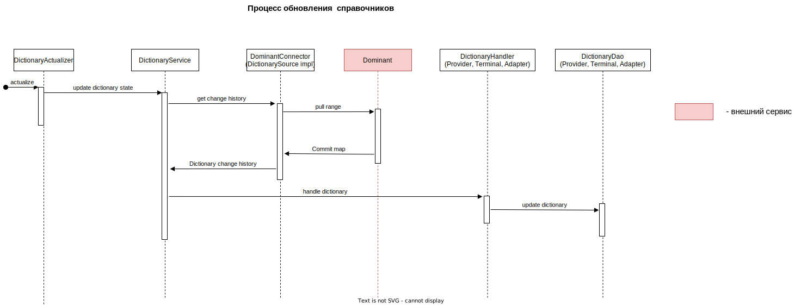
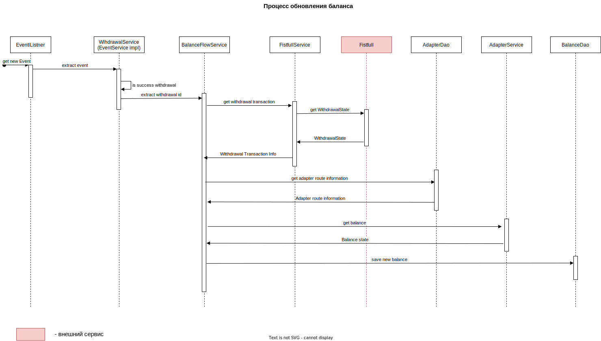

# scrooge

scrooge - сервис предназначен для опроса баланса выплатных счетов.

В функции сервиса входит:

- хранение и поддержание в актуальном состоянии информации о провайдерах, терминалах, адаптерах и счетах

- хранение и обновление баланса выплатных счетов путем опроса адаптеров

- предоставление информации о балансах

## Описание работы сервиса

Scrooge хранит информацию о терминалах, провайдерах, адаптерах и аккаунтах выплатных адаптеров в своей БД. Справочную
информацию сервис получает из
dominant ([протокол взаимодействия](https://github.com/valitydev/damsel/blob/dcd92ddba44e1d4dd9902f8c96c5524353ddd82b/proto/domain_config.thrift#L148))
.

Схема взаимодействия:

При получении нового события об успешной выплате сервис запрашивает информацию об обновленном баласе и сохраняет ее в
БД.

Схема взаимодействия:

Протокол взаимодействия с адаптерами описан [тут](https://github.com/valitydev/account-balance-proto).
