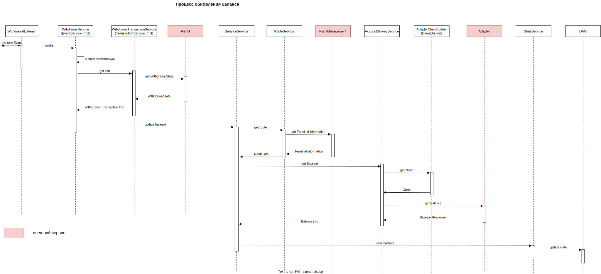

# scrooge

scrooge - сервис предназначен для опроса баланса выплатных счетов.

В функции сервиса входит:

- хранение и обновление баланса выплатных счетов путем опроса адаптеров

- предоставление информации о балансах

## Описание работы сервиса

Scrooge слушает топик mg-events-ff-withdrawal. При считывании нового события *StatusChange.Succeeded* запускается
процесс обновления баланса. По полученному идентификатору транзакции scrooge берет из fistful всю необходимую информацию
о транзакции. С данными о транзакции scrooge идентифицирует адаптер, на котором транзакция была проведена, и запрашивает
у адаптера информацию о текущем балансе. В конце сервис сохраняет текущую информацию о балансе и счете.

Схема взаимодействия:

Протокол взаимодействия с адаптерами описан [тут](https://github.com/valitydev/account-balance-proto).
